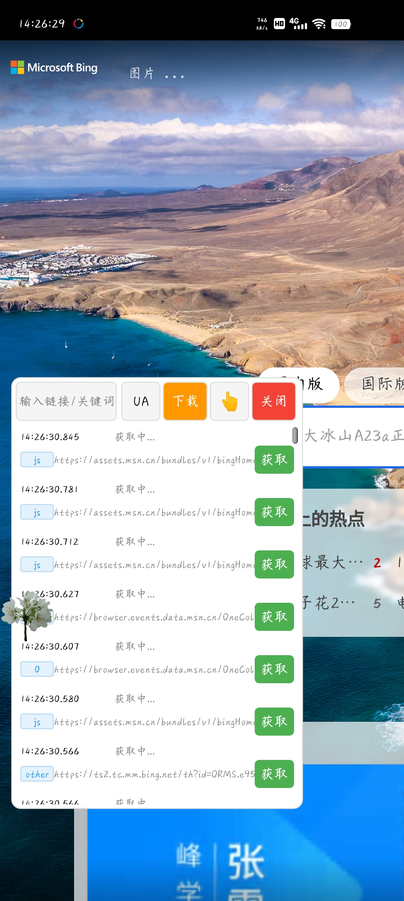
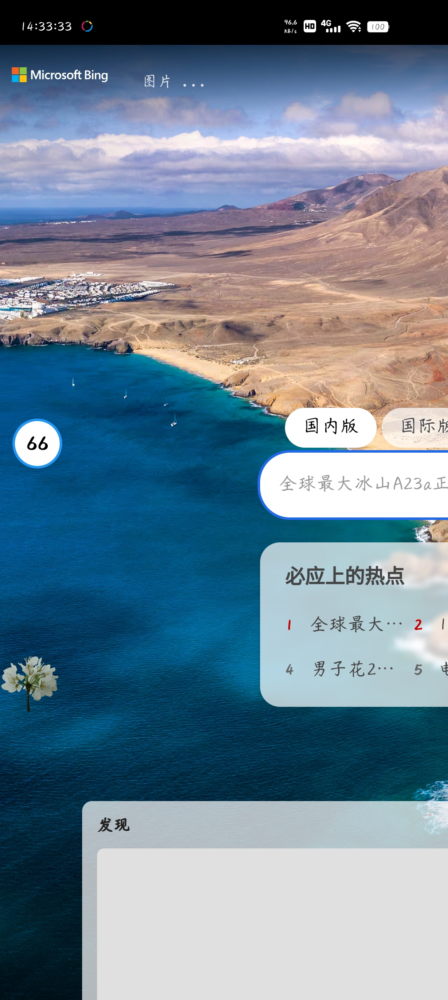

# 请求查看

## 项目描述
Android网络请求监控工具，实时捕获和显示网络请求

## 功能特性
- 网络请求监控
- 实时请求捕获
- 请求详情查看
- 请求过滤功能
- 隐藏面板功能
- 面板显示功能

## 使用说明
打开应用即可开始监控网络请求，支持过滤和隐藏面板

## 技术实现
- 网络请求拦截
- 实时数据捕获
- 动态面板显示
- 多维度请求过滤

## 项目结构
```
请求查看/
├── app/
│   ├── src/
│   │   └── main/
│   │       ├── AndroidManifest.xml
│   │       ├── java/request/check/MainActivity.java
│   │       └── res/
│   └── build.gradle
├── images/
│   ├── 请求查看-面板.jpg
│   └── 请求查看-隐藏.jpg
├── build.gradle
├── settings.gradle
└── README.md
```

## 应用截图

### 面板显示


### 隐藏状态
